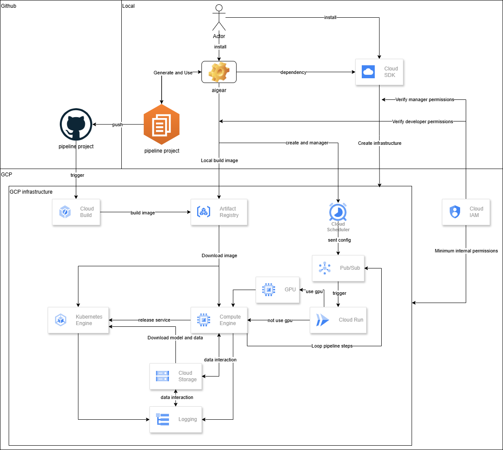

<div align="center">

# Cloud-Native ML Deployment & Automation Framework

[**Installation**](#installation) · [**Quick Start**](#quick-start) · [**Tutorial**](docs/tutorial.md) · [**CLI Reference**](docs/cli-reference.md) · [**Configuration Guide**](docs/route-guide.md) · [**Cost Estimation**](docs/cost-estimation.md)

</div>

## What is Aigear?

Aigear is a Python package that closes the gap between model development and production deployment. Instead of coordinating across data science, MLOps, and DevOps teams to set up cloud infrastructure, containerize pipelines, and expose model APIs, you describe your project once in `env.json` and let Aigear handle the rest—provisioning GCP resources, building Docker images, scheduling pipeline runs on ephemeral compute, and deploying models as gRPC microservices.

---

## Installation

### Prerequisites

Aigear provisions GCP resources and manages Kubernetes deployments. The following CLI tools must be installed and authenticated before use:

- **[gcloud CLI](https://cloud.google.com/sdk/docs/install)** — required for all GCP operations (infrastructure, Cloud Scheduler, Artifact Registry, etc.)
  ```bash
  gcloud auth login
  ```
- **[kubectl](https://kubernetes.io/docs/tasks/tools/)** — required only if deploying the gRPC model service to GCP Kubernetes (`aigear-deploy-model`)

### Install Aigear

```bash
pip install -U aigear
```

---

## Quick Start

### 1. Initialize a project

```bash
aigear-init --name my_ml_service --pipeline_versions v1,v2
```

This creates the following project structure:

```
my_ml_service/
├── cloudbuild/
│   └── cloudbuild.yaml
├── docs/
├── kms/
├── src/
│   └── pipelines/
│       ├── v1/
│       │   ├── fetch_data/
│       │   ├── preprocessing/
│       │   ├── training/
│       │   └── model_service/
│       └── v2/
│           ├── fetch_data/
│           ├── preprocessing/
│           ├── training/
│           └── model_service/
├── Dockerfile.pl               # Pipeline container
├── Dockerfile.pl.dockerignore
├── docker-compose-pl.yml
├── requirements_pl.txt
├── Dockerfile.ms               # Model service container
├── Dockerfile.ms.dockerignore
├── docker-compose-ms.yml
├── requirements_ms.txt
├── env.sample.json
└── README.md
```

> **Two Dockerfiles:** `Dockerfile.pl` is for the training pipeline; `Dockerfile.ms` is for the gRPC model serving service.

### 2. Configure `env.json`

Copy `env.sample.json` to `env.json` and fill in your GCP project, bucket, service accounts, etc. See the [configuration guide](docs/route-guide.md).

### 3. Create GCP infrastructure

```bash
aigear-gcp-infra --create
```

### 4. Generate env schema (optional)

```bash
aigear-env-schema --generate
# Force regenerate
aigear-env-schema --generate --force
```

Auto-generates a Pydantic model from your `env.json`. This gives you full type hints and IDE auto-complete when reading configuration, so you can navigate from any variable directly back to its definition in `env.json` instead of looking up string keys manually.

### 5. Implement your pipeline

Fill in the generated scaffold with your own code:

- **Pipeline steps** — implement each stage under `src/pipelines/v1/` (e.g., `fetch_data/`, `preprocessing/`, `training/`, `model_service/`).
- **Dockerfiles** — edit `Dockerfile.pl` (training pipeline) and `Dockerfile.ms` (model service) to install your dependencies. The generated files include working templates you can build on.
- **Dependencies** — add your Python packages to `requirements_pl.txt` and/or `requirements_ms.txt`.

### 6. Build Docker images

```bash
# Build both pipeline and model service images
aigear-image --create

# Build and push to Artifact Registry in one step
aigear-image --create --push

# Push a previously built image without rebuilding
aigear-image --push
```

### 7. Schedule pipeline steps

Creates a Cloud Scheduler job on GCP that triggers the specified pipeline steps on a cron schedule defined in `env.json`.

```bash
aigear-scheduler --create --version v1 --step_names fetch_data,preprocessing,training
```

To trigger a run immediately, pause, or manage the job lifecycle:

```bash
aigear-scheduler --run    --version v1
aigear-scheduler --pause  --version v1
aigear-scheduler --resume --version v1
aigear-scheduler --status --version v1
```

> See `aigear-scheduler --help` or the [CLI Reference](docs/cli-reference.md#aigear-scheduler) for all available commands.

---

> For a complete end-to-end walkthrough — from writing pipeline code and building images to deploying a gRPC model service on Kubernetes — see the **[Tutorial](docs/tutorial.md)**.

---

## Key Features

- **Infrastructure Automation**: Automatically create GCS buckets, Pub/Sub topics, Cloud Scheduler jobs, Service Accounts, and more.
- **Containerized Reproducible Runs**: Execute tasks inside predictable container environments to ensure reproducibility.
- **Scheduling & Auto-Retraining**: Support cron schedules, dependency steps, and automated retraining pipelines.
- **Versioning & Secrets**: Model versioning and configuration management with support for GCP Secret Manager.
- **Ephemeral Compute**: Launch short-lived VMs or Cloud Functions to run tasks and tear them down after completion.
- **gRPC Model Serving**: Deploy ML models as gRPC microservices locally or on GCP.

---

## Architecture



---

## Core Principles

- **Everything is a Task**: Model training, evaluation, packaging, and deployment are modeled as composable tasks.
- **Reproducible & Auditable**: Each run executes in a controlled container or ephemeral instance; configurations and outputs are traceable.
- **Least Privilege & Ephemeral Resources**: Use short-lived VMs or instances for jobs and automatically clean them up after completion to control cost and risk.
- **Centralized, Not Scattered**: Training pipeline and model service code live together under a single versioned project. Configuration, secrets, and infrastructure definitions are consolidated in one `env.json`—no more hunting across repos, scripts, and dashboards.
- **You Own the Code**: Aigear scaffolds the structure and handles infrastructure, but your pipeline logic runs as plain Python. No proprietary SDK to wrap your code in, no lock-in to a platform's execution model—making it easy to understand, extend, and debug compared to more opinionated MLOps platforms.

---

## Why Aigear?

| Scenario | Without Aigear | With Aigear |
|---|---|---|
| **Security & permissions** | No clear permission boundaries — access control becomes unmanageable as the team grows | Clear separation of two roles: **owner** (full GCP access for infrastructure provisioning, recommended to run in Cloud Shell) and **developer** (limited permissions for day-to-day pipeline work) |
| **Deploy a model** | Wait days/weeks for DevOps to provision buckets, IAM, and schedulers | Run `aigear-gcp-infra --create` — infrastructure ready in approximately 2 hours |
| **Multi-team consistency** | Each team requests resources manually; mismatched names and roles cause repeated delays | One `env.json` config shared across teams; Aigear creates what's missing and validates the rest |
| **Reproducibility** | "Works on my laptop" — Python version mismatches, scattered secrets, failed re-runs | Every pipeline runs in a versioned Docker container with validated config and automatic result logging |
| **Cost control** | Forgotten VMs run all week; surprise cloud bills | All VMs are ephemeral — spin up for the job, delete on completion; pay only for what runs |

---

## CLI Reference

See the full [CLI Reference](docs/cli-reference.md) for all commands and arguments.

| Command | Description |
|---|---|
| `aigear-init` | Initialize a new project scaffold |
| `aigear-gcp-infra` | Create GCP infrastructure (buckets, IAM, Pub/Sub, schedulers) |
| `aigear-task` | Run a pipeline step (`workflow`) or start a gRPC model server (`grpc`) |
| `aigear-scheduler` | Manage Cloud Scheduler jobs (create / update / delete / run / pause / resume) |
| `aigear-image` | Build and/or push Docker images to Artifact Registry |
| `aigear-model-yaml` | Generate Kubernetes deployment YAML files for model services |
| `aigear-deploy-model` | Deploy or delete a gRPC model service (local Kubernetes or GCP) |
| `aigear-env-schema` | Auto-generate a Pydantic schema from `env.json` |
| `aigear-kms-env` | Encrypt or decrypt `env.json` using Cloud KMS |

---

## Supported Platforms & Roadmap

**Currently supported:**
- **Cloud:** Google Cloud Platform (GCS, Pub/Sub, Cloud Scheduler, Cloud Functions, Compute Engine, Kubernetes Engine, Artifact Registry)
- **Notifications:** Slack
- **Compute:** Ephemeral VMs(self-terminating after each job)

**Known limitations:**
- Some commands only support creation — update and delete operations are not yet available for all resources
- Resource management is incomplete — version tracking and lifecycle management are missing
- No Cloud Build support yet
- Pipeline orchestration is step-based only — no DAG/dependency analysis yet

**Planned:**
- Improve functionality
- AWS and Azure support
- DAG/task dependency parsing for controlled parallel execution
---

## Contributing & Contact

Contributions, issues, and PRs are welcome. Share internal use-cases to help evolve common conventions. For questions or feature requests, open an issue in the repository or contact the maintainers.

- **Issues**: [GitHub Issues](https://github.com/retail-ai-inc/aigear/issues)
- **Discussions**: [GitHub Discussions](https://github.com/retail-ai-inc/aigear/discussions)

---

<div align="center">

**Built with ❤️ by Retail AI Inc.**

[Star this repo](https://github.com/retail-ai-inc/aigear/stargazers) if you find it helpful!

</div>
